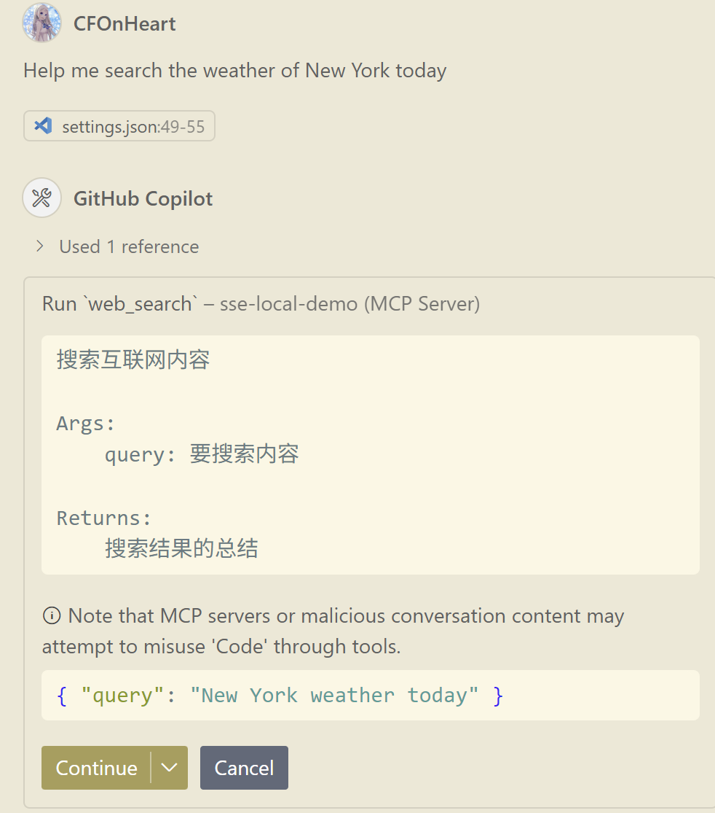

### First Creaetd this project
1. uv init sse-mcp-server-demo 
2. cd sse-mcp-server-demo
3. uv venv
4. .venv\Scripts\activate
5. uv add mcp[cli] httpx
6. uv run ./main.py

### How to run this project
1. Create `.env` file locally and set your BIGMODEL_API_KEY, like
```dotnetcli
BIGMODEL_API_KEY=<You api key>
```
You could get your API key from [BigModel APIKey](https://www.bigmodel.cn/usercenter/proj-mgmt/apikeys).
2. .venv\Scripts\activate
3. uv run ./main.py
4. Add the following configuration into your mcp client settings. e.g., VS Code Agent
```json
"mcp": {
    "servers": {
        "sse-local-demo": {
        "url": "http://127.0.0.1:9000/sse"
        }
    }
}
```
5. Open the MCP client in VSCode, and you should see the SSE server is connected.
6. Send a message to the agent, and the agent will select the tool for you.


## References
- [MCP Server for developers](https://modelcontextprotocol.io/quickstart/server)
- [MCP-Chinese-Getting-Started-Guide
](https://github.com/liaokongVFX/MCP-Chinese-Getting-Started-Guide)